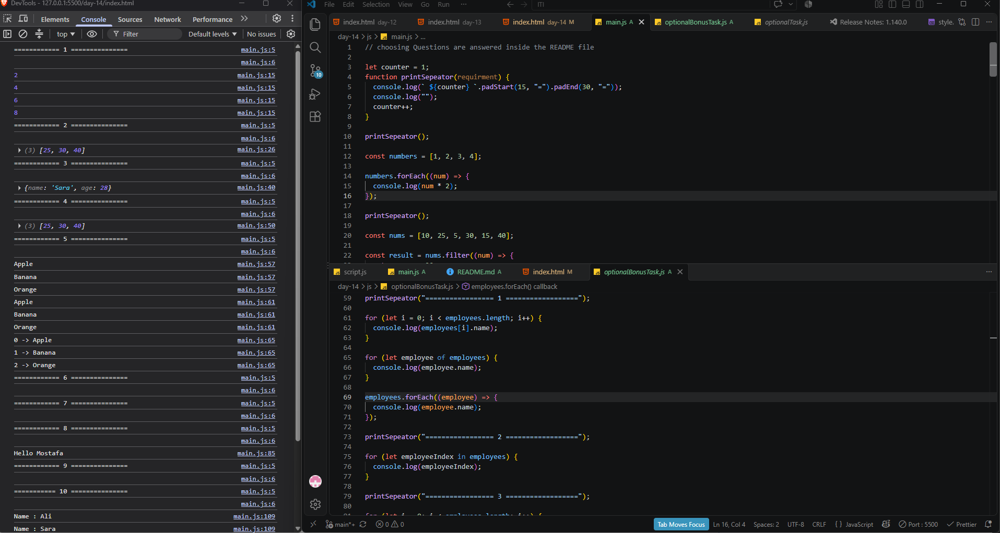
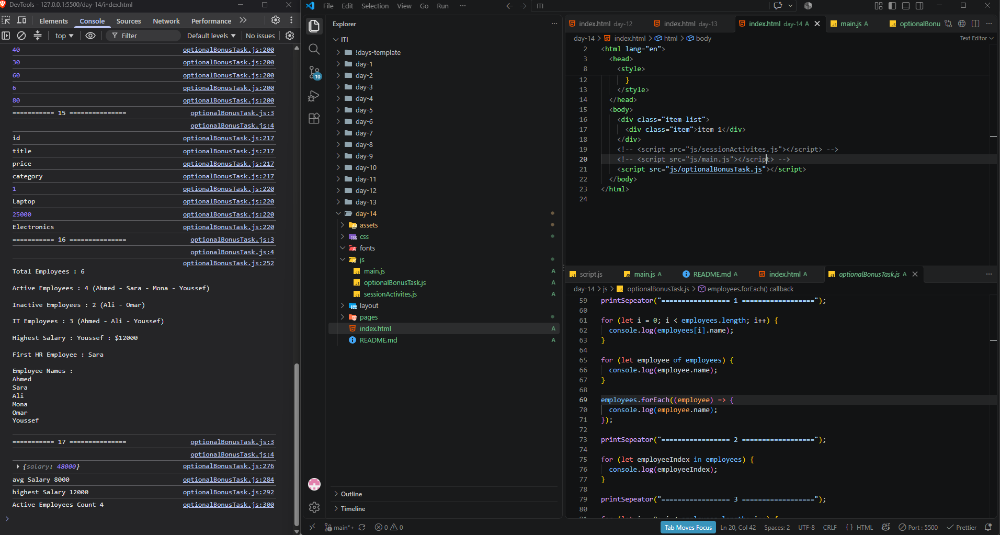

# Task 1



# Task 2 Advanced (Bonus)



# 🧠 Task - JavaScript (ES6 + Loops + Higher Order Functions)

# Part 1 - Choose

### 1) إيه اللي بيرجعه `map()` ؟

- [ ] أول عنصر يحقق شرط
- [ 🟢] Array جديدة بنفس الطول
- [ ] Boolean
- [ ] Number

---

### 2) مين فيهم بيرجع أول عنصر يحقق الشرط؟

- [ ] filter()
- [ ] map()
- [ 🟢] find()
- [ ] forEach()

---

### 3) `filter()` بيرجع...

- [ ] أول عنصر
- [ 🟢] Array جديدة بالعناصر اللي حققت الشرط
- [ ] Number
- [ ] String

---

### 4) `forEach()` بيرجع...

- [ ] Array جديدة
- [ ] أول عنصر
- [ 🟢] undefined
- [ ] Boolean

---

### 5) `for...of` بنستخدمها غالباً مع...

- [ ] Objects
- [ 🟢] Arrays
- [ ] Functions
- [ ] Classes

---

# Part 2 - True or False

1. `map()` بيغير الـ Array الأصلية. :False
2. `filter()` ممكن يرجع Array فاضية. : True
3. `find()` ممكن يرجع undefined. : True
4. `for...in` بيلف على الـ Index بتاع الـ Array. : True
5. `forEach()` ينفع أعمل بيها break. : False

---

# Part 3 - Compelete the following

## Q1

خلي الكود يطبع:

```
2
4
6
8
```

```js
const numbers = [1, 2, 3, 4];

numbers.________((num) => {
  console.log(num * 2);
});
```

---

## Q2

طلع Array فيها الأرقام الأكبر من 20.

```js
const nums = [10, 25, 5, 30, 15, 40];

const result = nums.________((num) => {
  return num > 20;
});

console.log(result);
```

---

## Q3

هات أول شخص عمره أكبر من 25.

```js
const users = [
  { name: "Ali", age: 20 },
  { name: "Sara", age: 28 },
  { name: "Omar", age: 30 },
];

const user = users.________((item) => {
  return item.age > 25;
});

console.log(user);
```

---

## Q4

حوّل كل الأسماء لـ Uppercase.

```js
const names = ["ali", "mona", "ahmed"];

const result = names.________((name) => {
  return name.toUpperCase();
});

console.log(result);
```

---

# Part 4 - To Do

## عندك الـ Array دي

```js
const fruits = ["Apple", "Banana", "Orange"];
```

### 1)

اطبع كل عنصر باستخدام `for...of`

---

### 2)

اطبع الـ Index باستخدام `for...in`

---

### 3)

اطبع بالشكل ده باستخدام `forEach`

```
0 -> Apple
1 -> Banana
2 -> Orange
```

---

# Part 5 - To Do

## Q1

حوّل الكود لـ Arrow Function

```js
function sum(a, b) {
  return a + b;
}
```

---

## Q2

استخدم Destructuring

```js
const user = {
  name: "Mostafa",
  age: 25,
};
```

خد `name` و `age` في متغيرات.

---

## Q3

استخدم Template Literal

بدل

```js
console.log("Hello " + name);
```

---

## Q4

استخدم Spread Operator

```js
const arr1 = [1, 2, 3];
const arr2 = [4, 5, 6];
```

اعمل Array واحدة فيها الكل.

---

# Part 6 - Many Q

عندك البيانات دي:

```js
const students = [
  { name: "Ali", degree: 70 },
  { name: "Sara", degree: 95 },
  { name: "Ahmed", degree: 40 },
  { name: "Mona", degree: 85 },
  { name: "Omar", degree: 55 },
];
```

## Required

### 1)

اعمل Array فيها أسماء الطلبة بس.

---

### 2)

اعمل Array فيها الطلبة اللي درجاتهم أكبر من أو تساوي 60.

---

### 3)

هات أول طالب درجته أكبر من 90.

---

### 4)

اطبع أسماء كل الطلبة باستخدام `forEach()`.

---

# Bonus

بدون استخدام Loop عادية (`for` أو `while`)

احسب مجموع الأرقام دي باستخدام `reduce()` لو فاكرها أو دور عليها في الـ MDN

```js
const numbers = [5, 10, 15, 20];
```

# 🚀 JavaScript ES6 Challenge #2 (Bonus)

# Scinario

إنت شغال في شركة بتعمل Dashboard لإدارة الموظفين.

عندك الداتا دي:

```js
const employees = [
  {
    id: 1,
    name: "Ahmed",
    age: 22,
    salary: 6000,
    department: "IT",
    active: true,
  },
  {
    id: 2,
    name: "Sara",
    age: 27,
    salary: 8500,
    department: "HR",
    active: true,
  },
  {
    id: 3,
    name: "Ali",
    age: 20,
    salary: 4500,
    department: "IT",
    active: false,
  },
  {
    id: 4,
    name: "Mona",
    age: 30,
    salary: 10000,
    department: "Finance",
    active: true,
  },
  {
    id: 5,
    name: "Omar",
    age: 24,
    salary: 7000,
    department: "Marketing",
    active: false,
  },
  {
    id: 6,
    name: "Youssef",
    age: 29,
    salary: 12000,
    department: "IT",
    active: true,
  },
];
```

---

# Part 1 - Loops

### المطلوب

### 1

اطبع أسماء كل الموظفين باستخدام

- for
- for...of
- forEach

---

### 2

اطبع الـ Index باستخدام for...in

---

### 3

اطبع الموظفين النشطين (active = true) فقط باستخدام Loop عادية.

---

# Part 2 - ES6

## المطلوب

### 1

حوّل الدالة دي لـ Arrow Function

```js
function welcome(name) {
  return "Welcome " + name;
}
```

---

### 2

استخدم Destructuring

```js
const employee = employees[0];
```

واطلع

- name
- salary

---

### 3

اعمل نسخة جديدة من الـ employee باستخدام Spread Operator وزود فيها

```js
country: "Egypt";
```

---

### 4

استخدم Template Literal واطبع

```
Ahmed works in IT and earns 6000
```

---

# Part 3 - map()

### 1

اعمل Array فيها أسماء الموظفين بس.

---

### 2

اعمل Array فيها الرواتب فقط.

---

### 3

اعمل Array بالشكل ده

```js
["Ahmed (IT)", "Sara (HR)"];
```

---

### 4

اعمل Array جديدة تزود مرتب كل موظف 1000 جنيه.

> بدون تعديل الـ Array الأصلية.

---

# Part 4 - filter()

### طلع

1. الموظفين اللي مرتباتهم أكبر من 7000.

2. الموظفين اللي في قسم IT.

3. الموظفين النشطين.

4. الموظفين سنهم أقل من 25.

5. الموظفين اللي في قسم IT ومرتبهم أكبر من 5000.

---

# Part 5 - find()

### هات

1. أول موظف مرتبه أكبر من 9000.

2. أول موظف في قسم HR.

3. أول موظف غير نشط.

4. جرّب تجيب موظف الـ id بتاعه 100.

إيه اللي هيحصل؟

---

# Part 6 - Mixed Challenge

## المطلوب

اعمل النتائج دي بدون استخدام Loop عادية.

---

### 1

اعمل Array فيها أسماء الموظفين النشطين فقط.

---

### 2

اعمل Array فيها أسماء موظفين الـ IT فقط.

---

### 3

اعمل Array فيها أسماء الموظفين اللي مرتبهم أكبر من 7000.

---

### 4

اعمل Array بالشكل ده

```js
[
{
   employee:"Ahmed",
   bonus:600
},
...
]
```

> البونص = 10% من المرتب.

---

### 5

اعمل Array فيها أول حرف من اسم كل موظف.

مثال

```js
["A", "S", "A", "M"];
```

---

# Part 7 - Logical Thninking

### عندك

```js
const numbers = [5, 12, 8, 20, 15, 30, 3, 40];
```

---

### المطلوب

1. طلع الأرقام الأكبر من 10.

2. اضرب كل رقم ×2.

3. هات أول رقم أكبر من 25.

4. اطبع كل الأرقام.

5. اعمل Array فيها String بالشكل

```
Number is 5
Number is 12
```

---

# Part 8 - Object Challenge

عندك

```js
const product = {
  id: 1,
  title: "Laptop",
  price: 25000,
  category: "Electronics",
};
```

---

### المطلوب

1. اطبع كل الـ Keys باستخدام for...in.

---

### 2

اطبع كل الـ Values.

---

### 3

اعمل Object جديد وضيف

```js
stock: 15;
```

---

### 4

استخدم Destructuring.

---

# Part 9 - Mini Dashboard

اعمل Function اسمها

```js
dashboard();
```

لما تتنادى تطبع بالشكل ده

```
Total Employees : 6

Active Employees : ؟

Inactive Employees : ؟

IT Employees : ؟

Highest Salary : ؟

First HR Employee : ؟

Employee Names :

Ahmed
Sara
Ali
...
```

---

# Bonus

لو تعرف `reduce()`

بدون Loop عادية احسب

### 1

إجمالي المرتبات.

---

### 2

متوسط المرتبات.

---

### 3

أعلى مرتب.

---

### 4

عدد الموظفين النشطين.

---
