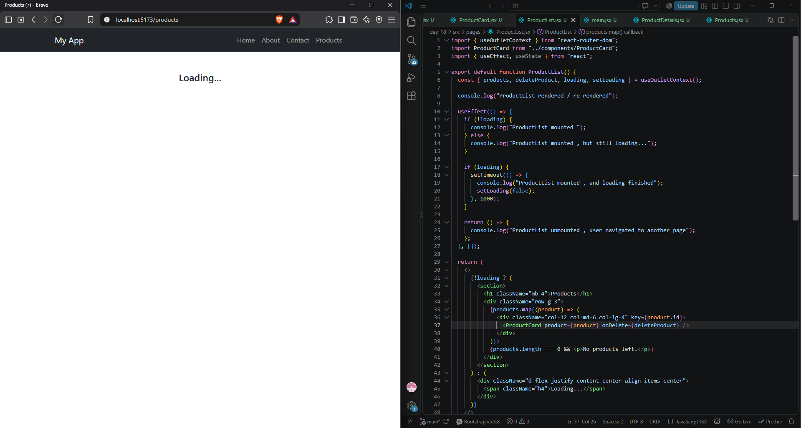
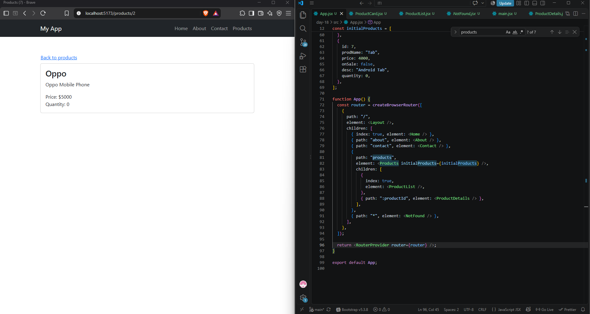
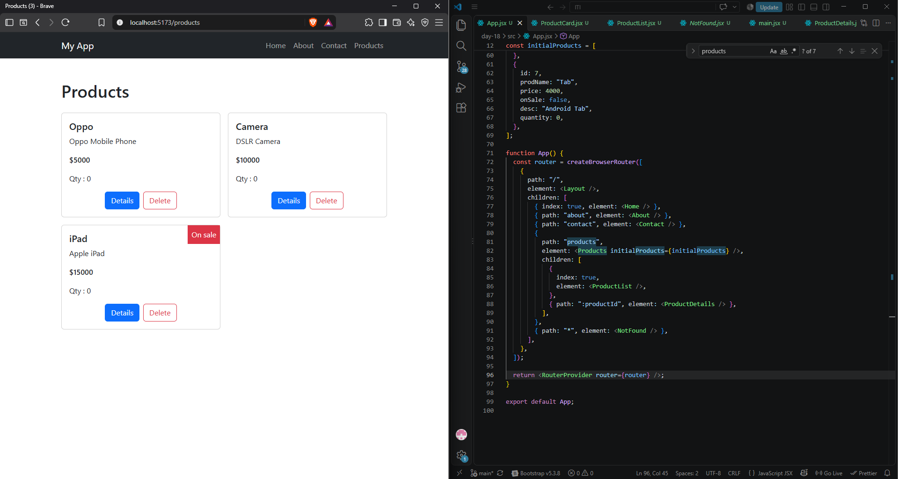
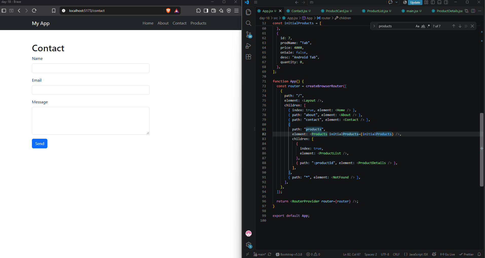
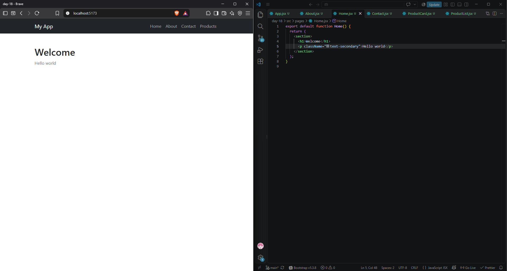

# Task

I applied a simple loading Screen using global state (so it only loads for first time while navigating between products) inside Products Component , and passed it using outlet context , also I've passed the products & delete function using the same method

---

I have made a simple nested details page that takes info from the global state and used new hook (useParams) that takes param from the url & used it to search for the object and display its details on this specific page

---

the state of products is global , meanning when I delete object then click details and get back the deleted project will not be available , (this only applies while exploring the products) , once another tab is clicked it will restart the products with initial value

---

